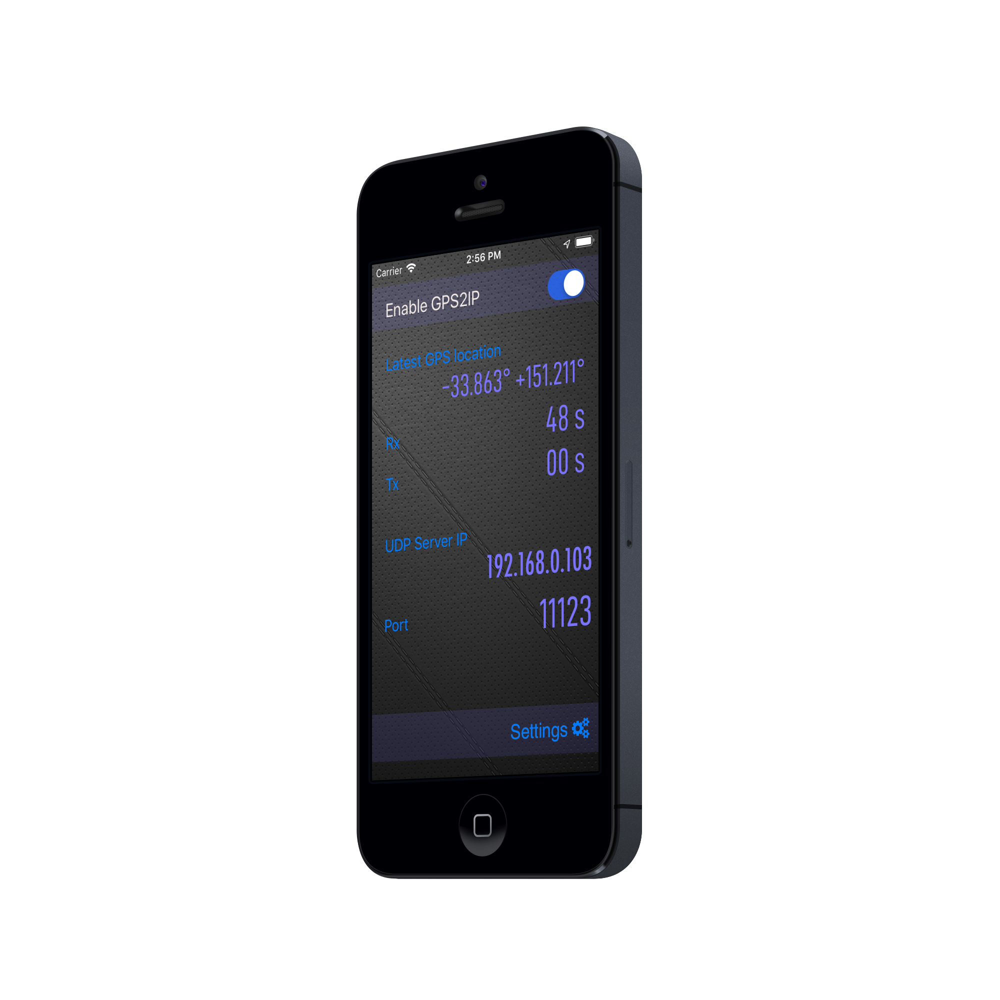

# Tutorials

## 

## Getting connected to GPS2IP by comport

Many software applications accept NMEA input from a serial port.  
This is a legacy from the days when PCs often had a real, physical COMPORT for interfacing with hardware, such as the mouse or keyboard.

Nowdays, the older ports are being replaced by USB/Thunderbolt. Thus, when a modern application requests data from a serial port, it becomes tricky.

Here is what we recommend to conmnect GPS2IP to your computer's serial port.

