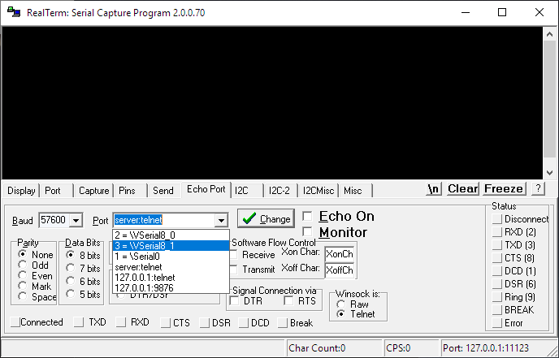

# Tutorials

## Getting connected to GPS2IP by comport

Many software applications accept NMEA input from a serial port.  
This is a legacy from the days when PCs often had a real, physical COMPORT for interfacing with hardware, such as the mouse or keyboard.

Nowdays, the older ports are being replaced by USB/Thunderbolt. Thus, when a modern application requests data from a serial port, it becomes tricky.

Here is what we recommend to conmnect GPS2IP to your computer's serial port.  
We need two systems:

1. A serial port
2. Some way to receive wireless data from GPS2IP

### Configure Serial port

We need a serial port \(or COM port\) for the navigation application to listen to. There probably isn't a hardware port on the back of your PC \(you will actually require _two_ to use a hardware method\), so we'll set up a software solution.

You will need two **virtual serial ports** to connect GPS2IP to an application on your computer.  
This is just like a 'real' serial port, but exists only in software on your PC.  
There are a few diferent ways you can do it, and a few software solutions that provide this ability.  
For this tutorial, we'll use [Eltima Virtual Serial Port Driver](https://www.virtual-serial-port.org/products/). The full version costs a modest amount, but I believe there are free alternatives.

You need two virtual serial ports, because your navigation application will listen on one port, and the GPS2IP data will go into the other. When connected, the data will appear in your application.

First, add two \(connected\) virtual serial ports.

These should now be visible to all applications on your PC.  
Next step!

### Receive wireless GPS2IP data

There are a few methods to connect wirelessly to GPS2IP, depending on your situation and requirements.  
There are examples on the GPS2IP website:

* Socket mode, [here](http://capsicumdreams.com/iphone/gps2ip/socketMode.php)
* TCP/UDP Push mode, [here](http://capsicumdreams.com/iphone/gps2ip/tcpPushMode.php)

Once you have figured out how to connect, you need to receive the data, and transfer it into one half of your virtual serial port connection.

**RealTerm** is one solution. There are other alternatives, but it is free, and it works. You can get the latest version [here](https://sourceforge.net/projects/realterm/files/Realterm/).

Here we can see setting up the port that we are receiving GPS2IP data on.  
The IP address might be your PC \(127.0.0.1\), or the iOS device IP \(whatever that is\).  
Be sure to set the correct Port Number \(after the **:** character\) - 11123 in this example.

At this point, check that you are receiving GPS2IP data on that port.  
There is some more information/help on our website, [Socket Mode](http://capsicumdreams.com/iphone/gps2ip/socketMode.php#connectionTest), or [TCP/UDP Mode](http://capsicumdreams.com/iphone/gps2ip/tcpPushMode.php#connectionTest).

Next, we output into one half of the virtual serial port connection.

Here we can see that we are selecting one of the virtual serial ports as the output from RealTerm.  
\(The new virtual ports have been called **VSerial8\_0**, and **VSerial8\_1**\).

If we push data into one end of this connection, it will come out the other \(which your application is listening to\).

Enable **Echo On**, and hit 'Change' to enable the output to the port we just selected.

Now if your PC receives data from GPS2IP, it will be output to that serial port \(COM3 / **VSerial8\_1**\).

### Setup your Application

Now that data is flowing into the serial port we selected, it will come out the other port of that connected pair.

If you select that port as the input for your application, you should receive NMEA from GPS2IP.

If you still have any trouble, [Get in Touch](http://capsicumdreams.com/contact/), and we'll try and sort out the problem..

